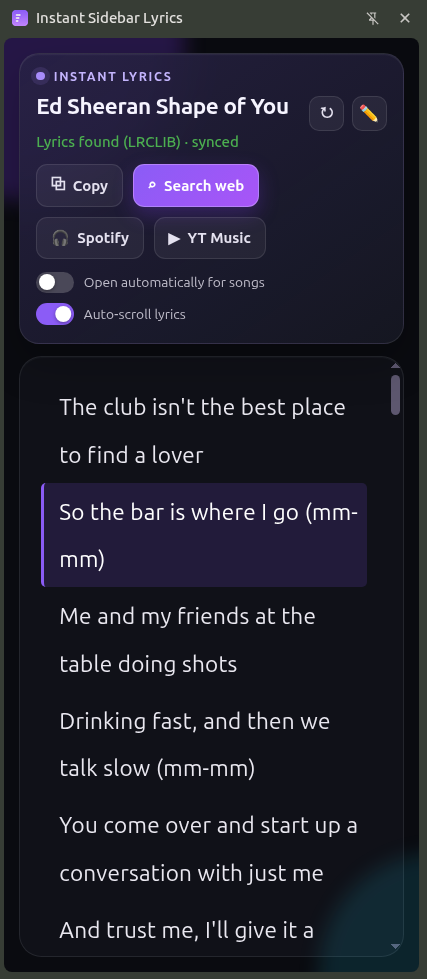

# Instant Sidebar Lyrics

Instant Sidebar Lyrics is an unpacked Chrome extension that finds lyrics for the song playing on YouTube and displays them in Chrome's side panel. It supports synced LRC lyrics, manual corrections, and several fallback sources when a direct match is unavailable.

> This is an independent project and is not affiliated with YouTube, Google, Spotify, Genius, LRCLIB, or any other lyrics provider.

## Preview



## Features

- Detects the title of the current YouTube video and follows a song playing in a background tab.
- Searches LRCLIB first, then uses additional metadata and lyrics sources as fallbacks.
- Displays synced LRC lyrics with active-line highlighting and optional auto-scroll.
- Lets you correct the detected title and search again.
- Saves manually entered lyrics in local extension storage.
- Can submit a manual correction to LRCLIB after you explicitly choose to do so.
- Copies lyrics or opens matching searches on the web, Spotify, and YouTube Music.
- Optionally opens the side panel for videos that appear to be songs.

## Install from source

### Requirements

- Google Chrome or another Chromium browser with Manifest V3 side-panel support
- Node.js and npm, if you want to rebuild the bundled JavaScript

### Steps

1. Clone the repository:

   ```bash
   git clone https://github.com/Yashwanth034/songlyricsfinder.git
   cd songlyricsfinder
   ```

2. Install dependencies and build the side-panel bundle:

   ```bash
   npm ci
   npm run build
   ```

3. Open `chrome://extensions` in Chrome.
4. Enable **Developer mode**.
5. Select **Load unpacked** and choose the repository folder.
6. Open a YouTube watch page, play a song, and select the extension icon to open the lyrics panel.

The repository includes the built `dist/sidepanel.js`, so you can also load it directly without rebuilding. Rebuild after changing `sidepanel.js`.

## How to use

1. Play a music video on a standard `youtube.com/watch` page.
2. Open **Instant Sidebar Lyrics** from the browser toolbar.
3. Wait for the extension to detect the title and search for lyrics.
4. If the match is incorrect, use the edit button beside the title and search again.
5. Turn on **Auto-scroll lyrics** when synced lyrics are available.

If no result is found, use **Search web**, paste the correct lyrics into the manual entry area, and save them. Saved lyrics stay in the browser unless you explicitly press **Submit to LRCLIB Community**.

## Privacy and network access

The extension does not require an account and does not include an analytics SDK. It stores settings with Chrome sync storage, temporary tab state with session storage, and manually saved lyrics/title corrections with local extension storage.

To find lyrics and song metadata, search terms and relevant page URLs may be sent to services allowed in [`manifest.json`](manifest.json), including LRCLIB, Lyrics.ovh, Genius, AZLyrics, Letras, Spotify, Deezer, iTunes, JioSaavn, YouTube Music, search engines, and CORS proxy services. Those services have their own privacy policies and availability rules.

Manual lyrics are published to LRCLIB only after you press the submission button. Review the text before submitting it and submit only content you are permitted to share.

## Permissions

| Permission | Why it is used |
| --- | --- |
| `activeTab` and `scripting` | Read the current YouTube video title and playback state after user interaction. |
| `sidePanel` | Show lyrics beside the current page. |
| `storage` and `unlimitedStorage` | Save preferences, title corrections, and manual lyrics. |
| YouTube host access | Detect songs and follow playback on YouTube watch pages. |
| Lyrics, music, search, and proxy host access | Look up song metadata and lyrics using the fallback pipeline. |

## Development

```bash
npm ci
npm run build
```

After rebuilding, reload the extension from `chrome://extensions`.

### Project structure

- `manifest.json` — extension metadata, permissions, and entry points
- `background.js` — side-panel behavior and tab/session coordination
- `content.js` — YouTube title and playback detection
- `sidepanel.html` / `sidepanel.css` — side-panel interface
- `sidepanel.js` — lyrics lookup, matching, storage, and UI logic
- `dist/sidepanel.js` — browser-ready bundle generated by esbuild
- `icons/` — extension icons

## Limitations

- Lyrics and metadata depend on third-party services and may be incomplete, rate-limited, or unavailable.
- YouTube Music fallback behavior relies on an undocumented web endpoint and may change without notice.
- Automatic song detection is heuristic and can occasionally classify a non-music video as a song.
- Website layout changes can affect title detection or lyrics extraction.

## Acknowledgements

This extension is made possible by the data, search capabilities, and public web services provided by:

- [LRCLIB](https://lrclib.net/) — primary source for plain and synchronized lyrics, and the destination for user-approved community submissions
- [Lyrics.ovh](https://lyrics.ovh/) — lyrics search fallback
- [Genius](https://genius.com/), [AZLyrics](https://www.azlyrics.com/), and [Letras](https://www.letras.com/) — additional lyrics discovery sources
- [YouTube](https://www.youtube.com/) — video playback and song-title detection
- [Spotify](https://www.spotify.com/), [Deezer](https://www.deezer.com/), [Apple iTunes Search](https://performance-partners.apple.com/search-api), [JioSaavn](https://www.jiosaavn.com/), and [YouTube Music](https://music.youtube.com/) — song metadata, matching, and external search options
- [Google](https://www.google.com/), [Bing](https://www.bing.com/), and [DuckDuckGo](https://duckduckgo.com/) — web-search fallbacks
- [cors.lol](https://cors.lol/), [AllOrigins](https://allorigins.win/), and [corsproxy.io](https://corsproxy.io/) — cross-origin request fallbacks
- [esbuild](https://esbuild.github.io/) and [LRCLIB challenge solver](https://www.npmjs.com/package/@lrclib.js/challenge-solver) — development and LRCLIB submission tooling

All names and trademarks belong to their respective owners. These acknowledgements do not imply sponsorship, endorsement, or affiliation.

## Contributing

Issues and pull requests are welcome. Keep changes focused, rebuild `dist/sidepanel.js` when changing `sidepanel.js`, and avoid committing credentials, local environment files, or generated dependency folders.
